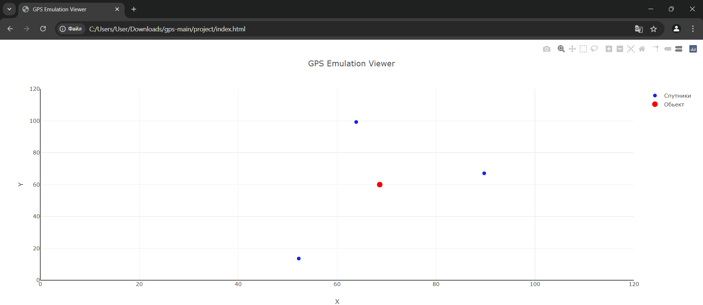

# GPS
### Об'єкт визначається за допомогою методу трилатерації, коли на екрані присутні три супутники. Якщо один із супутників зникає, функція призупиняє обчислення його позиції доти, поки третій супутник знову не стане доступним.
### Результат роботи:

