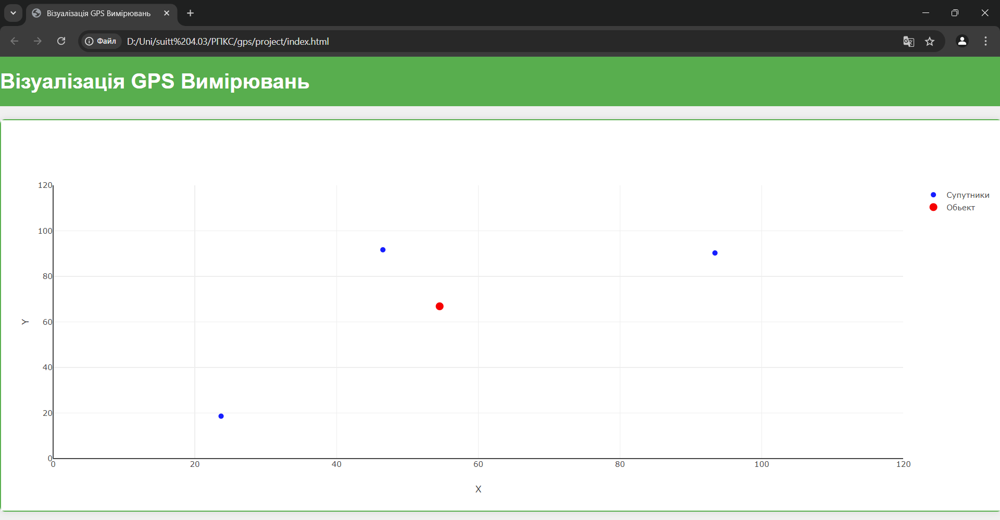

# GPS

Об'єкт визначається методом трилатерації, коли на екрані відображаються три супутники. Якщо один із супутників зникає, функція припиняє обчислення позиції об'єкта до моменту, поки не з'явиться третій супутник.

## Результат роботи 

